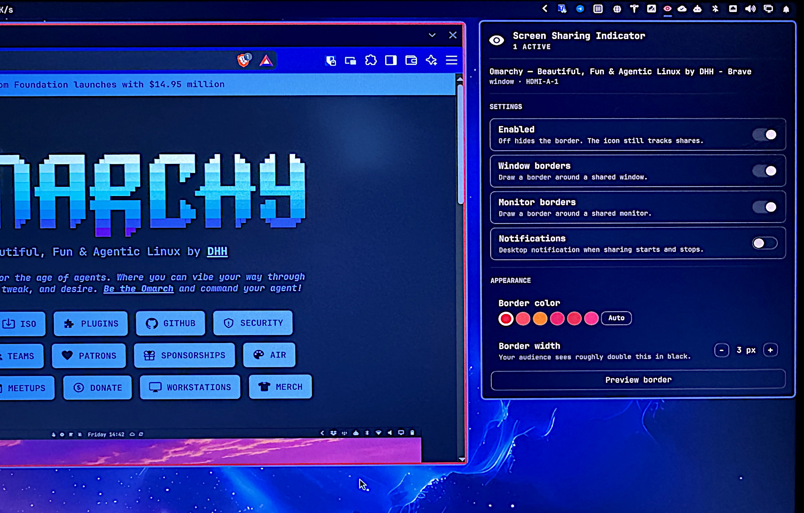

# Omarchy Screen Sharing Indicator

A presenter-only red border around the window or monitor you are currently sharing
through the desktop portal - Teams PWA, `teams-for-linux`, Meet, Discord, Zoom, OBS,
anything that goes through xdg-desktop-portal.

macOS draws this border in WindowServer. On Wayland a client cannot paint on another
window, and Hyprland has no built-in indicator, so you get no cue about *which*
surface you actually picked in the share dialog. This plugin adds one.



*Photographed off the screen rather than screenshotted: with the layer rule
loaded the border renders black in any capture, which is precisely the point.
The numbers are in [`tests/captures.md`](tests/captures.md).*

| | |
| --- | --- |
| Plugin id | `io.github.dennistdk.screen-sharing-indicator` |
| Install path | `~/.config/omarchy/plugins/io.github.dennistdk.screen-sharing-indicator/` |
| Target | Omarchy 4.0.2 · Hyprland 0.56.2 · Quickshell 0.3.1 |

## What each side sees

The border is four thin layer-shell strips, not a full-screen overlay. That matters:
Hyprland's `no_screen_share` fills a layer's whole **bounding box** with black in
monitor captures, so a full-screen overlay would black out your entire stream. Four
thin strips make the bounding box *be* the border.

| You are sharing | You see | Your audience sees |
| --- | --- | --- |
| A window | Red border around it | Nothing - window captures never include layer-shell surfaces |
| A monitor | Red border around the output | Thin black strips along the edges. Never red, never a blackout |
| A region | Red border around the whole monitor | The same thin black strips |

Those black strips are the accepted price of the red never leaking. Budget about
**twice `widthPx` in physical pixels** for them, not `widthPx` itself: Hyprland
expands the fill box a little beyond the surface, and a scaled display multiplies
everything by the scale factor again. Measured on a 3840x2160 output at scale 1.25,
the default `widthPx: 3` blacks out 6 physical rows. See
[`tests/captures.md`](tests/captures.md) for the measurements.

## Install

```bash
omarchy plugin add https://github.com/dennistdk/omarchy-screen-sharing-indicator.git --enable --yes
```

Or by hand:

```bash
git clone https://github.com/dennistdk/omarchy-screen-sharing-indicator.git \
  ~/.config/omarchy/plugins/io.github.dennistdk.screen-sharing-indicator
omarchy-shell shell rescanPlugins
omarchy plugin enable io.github.dennistdk.screen-sharing-indicator
```

Either way, enabling drops an eye icon into your bar's right section - see
"Bar widget" below for what it does. Drag it elsewhere, or move it with
`omarchy bar move`.

### Then do this - it is not optional

**The quick way.** Click the eye in your bar. If the layer rule is missing, the
dropdown shows a warning with a **Hide the border from your audience** button. Press it: it backs
up `~/.config/hypr/hyprland.lua`, appends the guarded loader below, and runs
`hyprctl reload`. The warning then clears itself - the plugin re-reads the marker
`hypr.lua` writes, so it confirms the rule really loaded rather than assuming the
write worked.

**By hand**, if you would rather nothing wrote to your compositor config: add this
to the personal section of `~/.config/hypr/hyprland.lua`, or to
`~/.config/hypr/autostart.lua`:

```lua
do
  local path = (os.getenv("HOME") or "") .. "/.config/omarchy/plugins/io.github.dennistdk.screen-sharing-indicator/hypr.lua"
  local f = io.open(path, "r")
  if f then
    f:close()
    local ok, err = pcall(dofile, path)
    if not ok then
      io.stderr:write("screen-sharing-indicator hypr.lua: " .. tostring(err) .. "\n")
    end
  end
end
```

Then `hyprctl reload`.

**Without this snippet your audience sees the red border burned into every monitor
share.** The layer rule it loads is what keeps the border out of captures.

Keep the `io.open` guard and the `pcall`. A bare `dofile` breaks your *entire*
Hyprland config the moment the file goes missing, which is exactly what happens when
you uninstall the plugin. The button always emits the guarded form; hand-copying is
the one path where that guard goes missing, which is why the button exists.

## Uninstall

Order matters:

```bash
omarchy plugin disable io.github.dennistdk.screen-sharing-indicator   # or: omarchy plugin remove
# delete the snippet from your hypr config
hyprctl reload
```

Disabling alone unmaps every strip. A guarded snippet pointing at a deleted file is a
harmless no-op, so leaving it behind breaks nothing - but tidy it up anyway.

## Bar widget

Enabling the plugin puts an eye in the bar. It is always visible, even when
there is nothing to show: a privacy indicator that vanishes when idle cannot
be told apart from one that has died.

It answers one question - **is something being captured right now?** - from
the session table, not from whether a border happens to be drawn. Those come
apart: switch **Window borders** off during a window share and the border goes
away while the capture does not. The eye stays red.

| State | Glyph | Meaning |
| --- | --- | --- |
| Dim eye | open | Enabled, nothing is being captured. |
| Bright red eye | open | Something is being captured right now. A border is up too, unless you have switched that border type off. |
| Dim, slashed eye | slashed | `active: false` - the plugin is switched off, and nothing is being captured. |
| Bright red, slashed eye | slashed | `active: false` **and** something is being captured. No border is being drawn - you asked for it not to be. |

A **Preview border** does not turn the eye red: a preview is not a capture.

Click the eye for the dropdown. It carries:

- **What's being shared** - one line per session (identity, type, output), or
  "Nothing is being shared". A session that is not bordered yet is listed with
  a state word - `window · starting`, or `window · stopping` for one that
  ended before its border came up - rather than hidden: a share the border has
  not caught up with is still a share. The count beside the title is of
  sessions actually bordered, so a share picker sitting open with nine live
  preview sessions reads "0 active" over nine `starting` rows.
- **Settings** - four toggles: **Enabled** (the `active` key), **Window
  borders**, **Monitor borders**, **Notifications**. The first three change only
  what is *drawn*. None of them stops a capture, so none of them changes the
  eye, and flipping one mid-share never produces a notification - a toast
  fires when a share really starts or really stops, and at no other time. The
  same holds for a border that comes and goes on its own: switch desktops during
  a window share and the border is withdrawn until you switch back, silently.
- **Appearance** - six colour swatches plus an **Auto** mode, a border-width
  stepper, and a **Preview border** button that draws the border for three
  seconds on your focused output with no capture involved, so you can judge a
  colour or width change without joining a call. A preview draws real strips,
  so you see exactly what your audience would see the black residual of, but
  it is never treated as a share and never fires a notification - not even if
  a real share starts and ends while it is running.
- **Health warnings**, shown only when something needs attention: whether the
  layer rule that keeps the border out of monitor captures actually loaded (see
  "Then do this" under Install), and whether your pointer reaches the audience
  during a share (see "Cursor" below), with a one-click fix. The layer-rule
  warning sits at the top of the dropdown, because its consequence is
  happening to your audience right now. The cursor fix sits at the foot of
  Appearance, with a one-line "Cursor issue - see Appearance below" pointer at
  the top so it is never something you have to scroll to discover.

**Removing the widget from your bar stops the border entirely.** The plugin
ships as both a `service` (which watches for shares and draws the border) and a
`bar-widget` (the chip), but there is exactly one `shell.json` entry between
them - the widget's own bar entry, holding all of your settings. Delete the
chip and that entry goes with it, leaving nothing to tell the shell to run
the service: no border, whatever else is configured, until you add the widget
back. That is how third-party plugins in this shell are enabled at all, which
is why M19 in [`tests/matrix.md`](tests/matrix.md) pins it down as expected
behaviour rather than something a future change may quietly regress.

## Settings

Most of these are also editable through the bar widget's dropdown (above):
`active`, the four toggles, `colorMode`, `color` and `widthPx` all have a
control there. `debounceMs` and `stopGraceMs` do not, and still need a hand
edit. Either way, every key lives inline on the widget's own entry in
`~/.config/omarchy/shell.json` (under `bar.layout.<section>` once the widget
is on your bar):

```json
{
  "id": "io.github.dennistdk.screen-sharing-indicator",
  "active": true,
  "colorMode": "fixed",
  "color": "#E81123",
  "widthPx": 3,
  "debounceMs": 700,
  "stopGraceMs": 1500,
  "showWindowBorders": true,
  "showMonitorBorders": true,
  "notify": false
}
```

| Key | Default | Notes |
| --- | --- | --- |
| `active` | `true` | Soft off switch. Unmaps every strip and stops drawing, but tracking continues so the chip stays honest about shares. Removing the widget from your bar does this too, and more - see "Bar widget" above. |
| `colorMode` | `"fixed"` | `"fixed"` always paints `color`. `"auto"` keeps `color` unless it is too close to your theme accent to tell apart, in which case it is pushed to the far end of a red/orange "alarm" hue band. It guards against confusability rather than following your theme, so a red border never turns green; if computing it throws, the border falls back to `color` rather than disappearing. |
| `color` | `#E81123` | Teams-ish red. Deliberately not your theme accent - a sharing cue should read as "you are being captured", not as decoration. Ignored while `colorMode` is `"auto"` and adjustment triggers. |
| `widthPx` | `3` | Border thickness in logical pixels, clamped 1-16. Also drives how much black your audience sees on a monitor share - roughly double this, in physical pixels. |
| `debounceMs` | `700` | How long a capture must last before the border appears, clamped 0-5000. Keeps PrintScreen and `grim` from flashing it. Values at or below 500 can still flash, because Hyprland's own idle-stop timer is 500 ms. |
| `stopGraceMs` | `1500` | How long a stop is held before the border comes down, clamped 0-5000. Hyprland ends a capture 500 ms after the last copied frame and emits the same event a real "stop sharing" does, so without this a still screen flickers and the border often never appears at all. The cost is that the border lingers this long after you genuinely stop. `0` unmaps on the stop event. |
| `showWindowBorders` | `true` | |
| `showMonitorBorders` | `true` | Also covers region shares. |
| `notify` | `false` | Desktop notification when a capture starts and stops. Off by default because the toast lands *inside* the capture: notifications are not covered by the layer rule, so a portal-backed recording gets it burned into its opening seconds. Turn it on if you want a second cue and are not recording. A screenshot, a preview or a settings change never triggers one - only a session past `debounceMs` counts. |

Changes apply live; no shell restart needed.

## Cursor

Whether your mouse pointer reaches your audience during a screen share is
governed entirely by `cursor_mode` in `~/.config/hypr/xdph.conf`, and Teams
in particular does not ask for it - so without it set, your pointer is simply
invisible in the capture, with nothing in this plugin or in Teams telling you
so.

**It applies when the portal starts, not when you edit the file.** Change
`cursor_mode` while the portal is running and the file on disk updates while
the live share does not, and nothing distinguishes "set and live" from "set
but stale" until you go looking. So the dropdown carries a standing check
rather than a one-time reminder: it compares the file's modification time
against the portal's start time, and can tell "you fixed it and the portal
has since restarted" apart from "you fixed it, but the portal hasn't picked
it up yet."

When the check finds a problem, the dropdown shows a **Fix** button that
edits `xdph.conf` (backing it up first) to set `cursor_mode = 2` inside the
`screencopy { }` block, then restarts `xdg-desktop-portal-hyprland`. Two
things worth knowing:

- **It refuses while you are sharing** rather than restarting the portal
  underneath a live capture. Press it mid-share and nothing is touched -
  including when the press lands inside the check's own read-then-write gap.
- **It changes only the default.** An app that explicitly asks the portal to
  hide the cursor still hides it. This fixes the common case, where nothing
  asked and the cursor vanished anyway.

## Checking on it

```bash
omarchy-shell screen-sharing-indicator status
```

Dumps the session table, the matched window addresses, and the strip count as JSON.

## Known limitations

- **Restarting the shell mid-share loses the border** until the next share starts.
  Hyprland has no "what is currently being captured?" query, and it will not re-emit a
  start event for a session that is already running.
- **Region shares border the whole monitor, not the region.** The `screencastv2`
  payload is `active,type,name` and nothing else, and for a region `name` is just
  the monitor. Hyprland *does* know the rectangle - `CScreenshareSession` holds it
  as `m_captureBox` and renders from it - it simply never puts it on the wire, so
  this is one upstream field away rather than impossible. Drawing a border around the whole
  monitor overstates what is shared, the safe direction for a privacy cue, and
  `status` reports `"type": "region"` so you can tell the two apart.
- **Sharing a browser tab draws a border around the whole browser window.** Hyprland cannot see tabs.
- **Two windows with the same title both get a border.** The share event identifies the
  target by title, so this is the honest answer rather than a guess.
- **Omarchy's own screen recorder is invisible to this plugin.**
  `omarchy-capture-screenrecording` defaults to gpu-screen-recorder's kms
  backend, which reads frames from DRM rather than through the portal, so
  Hyprland emits no `screencast` event and no border is drawn. Recording that
  way is also unaffected by the layer rule, so nothing is blacked out either.
  Export `OMARCHY_SCREENRECORD_USE_PORTAL=true` to record through the portal
  instead, which the plugin sees like any other client. OBS and other
  portal-based recorders are seen normally.
- **No rounded corners.** The strips are axis-aligned rectangles; rounding them would
  mean a larger bounding box, which means more black in your audience's capture.

## Development

```bash
./tests/run                      # pure-model unit tests, no compositor needed
omarchy plugin validate .        # manifest check
```

Anything that needs a live compositor - and most of it needs a real portal
client too - is written up as a runnable checklist in
[`tests/matrix.md`](tests/matrix.md), with the audience-side measurements in
[`tests/captures.md`](tests/captures.md). See [`CONTRIBUTING.md`](CONTRIBUTING.md)
before sending a change.

`ShareModel.js` holds all parsing, refcounting and geometry as pure functions with no
timers and no QML types, so it runs under plain node. `Service.qml` owns the Hyprland
event subscription, the debounce timers and the strip surfaces.

**Hot-reload does not work here.** Run `omarchy-restart-shell` after editing
anything, and verify against the journal:

```bash
journalctl --user -f | grep screen-sharing-indicator
```

It fails silently, in two different ways; [`CONTRIBUTING.md`](CONTRIBUTING.md)
has both, along with a `socat` one-liner for watching the raw compositor events.

## Dependencies

Nothing is vendored. Every file here is original work covered by the MIT
license - `Service.qml`, `Panel.qml`, `BarWidget.qml`, `Strip.qml`,
`ShareModel.js` and `hypr.lua`. There is no build step, no package manifest,
and no third-party library, font or icon in the tree.

What it expects to find on the system, all of it present in a default Omarchy
install:

| Component | Used for |
| --- | --- |
| Omarchy 4.x shell | Hosts the `service` and `bar-widget` entry points |
| Quickshell 0.3.1 | `Quickshell`, `.Hyprland`, `.Wayland`, `.Io`, plus Omarchy's `qs.Ui` and `qs.Commons` |
| Hyprland 0.56.2 | Layer-shell surfaces, the IPC event stream, and the `hl.layer_rule` Lua API `no_screen_share` comes from |
| xdg-desktop-portal-hyprland | The capture sessions the plugin watches |

External commands it runs:

| Command | When |
| --- | --- |
| `sh`, `cat`, `cp`, `date` | Reading config files, and backing one up before either one-click fix writes to it |
| `hyprctl reload` | After the layer rule fix |
| `systemctl --user restart xdg-desktop-portal-hyprland` | After the cursor fix |
| `notify-send` (libnotify) | Only while the Notifications toggle is on |

Development adds Node for `./tests/run`, which uses the standard library only -
`node:test` and `node:assert`, nothing to install. `tests/audience` and
`tests/record` also want `grim`, ImageMagick and `python3`.

## License

MIT - see [`LICENSE`](LICENSE). No third-party code is bundled; see
[Dependencies](#dependencies) for what the plugin expects from the system.
